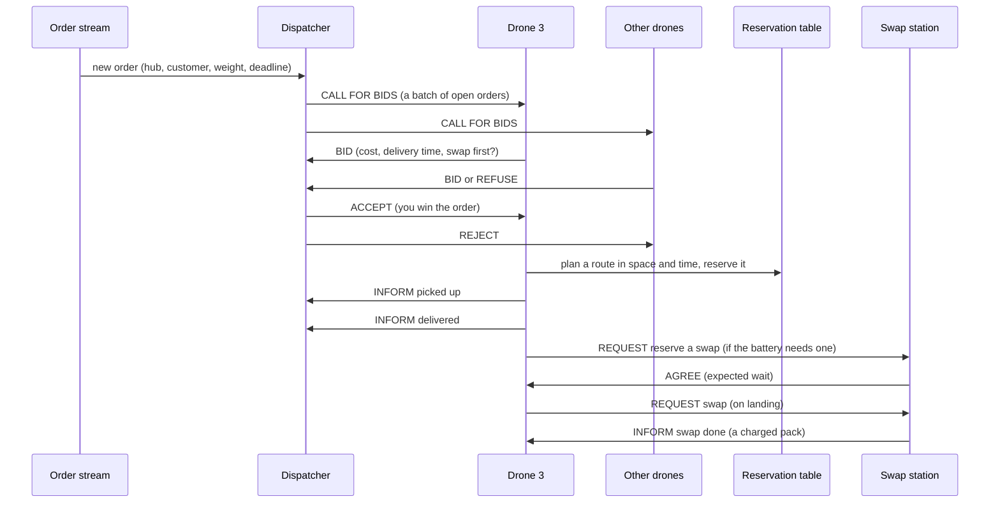
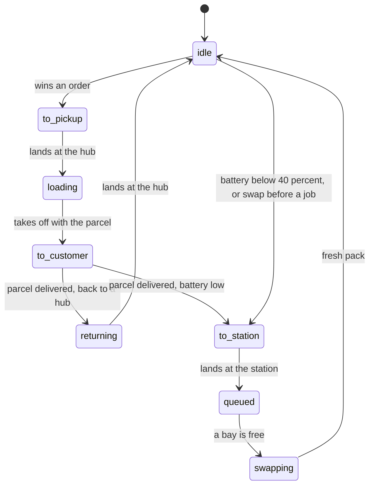
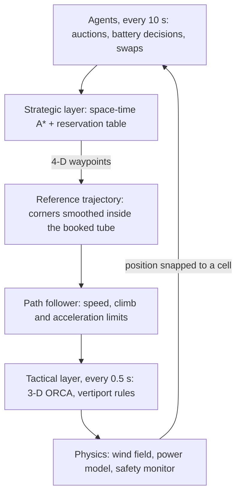

# Multi-Agent Drone Fleet Coordination for Package Delivery

A fleet of autonomous delivery drones shares one city's airspace. The drones
**bid for parcels** in an auction, **plan collision-free routes in space and
time** across **stacked altitude layers**, recover when **wind** knocks them
off course, and **swap batteries** at stations before they run dry. Every
interaction between them is a message, and the whole system is plain Python
(standard library only), so it runs anywhere with Python 3.10 or later.

Two flight models share the same agents. The **grid** model moves drones one
100 m cell or one 30 m layer per 10-second tick. **Continuous flight**
(`--motion continuous`) flies the same plans in metres and seconds, with speed
and acceleration limits, a wind field, a power model, and **3-D ORCA**
keeping drones apart. In continuous runs drones **cruise at 60 m and climb
over buildings**, and customers **live in houses and buildings, with parcels
lowered onto roofs at several heights**. Every run can be replayed in an
interactive 2D map or a 3D city, and every message between the agents is
logged in plain English.


## Contents

1. [Highlights](#highlights)
2. [Quick start](#quick-start)
3. [What is simulated](#what-is-simulated)
4. [How it works](#how-it-works)
5. [Replay viewers](#replay-viewers)
6. [Agent messages](#agent-messages)
7. [Command-line reference](#command-line-reference)
8. [Using it from Python](#using-it-from-python)
9. [Experiments and results](#experiments-and-results)
10. [Metrics](#metrics)
11. [Configuration reference](#configuration-reference)
12. [Tests](#tests)
13. [Project layout](#project-layout)
14. [Reproducibility and performance](#reproducibility-and-performance)
15. [Limitations](#limitations)
16. [Documentation](#documentation)

## Highlights

| | |
|---|---|
| **Agents** | `DroneAgent` ×N (hybrid deliberative/reactive), `DispatcherAgent` (Contract Net auctioneer), `SwapStationAgent` ×3 (battery-pack managers), an air-traffic-control broadcaster (no-fly-zone notices) |
| **Airspace** | "2.5-D": flight layers 1..`n_layers` (default 3, at 30/60/90 m) above the ground; buildings have heights and block only the layers at or below them; vertical take-off and landing at pads; optional heading rule |
| **Route planning** | 3-D space-time A* over a shared reservation table (Cooperative A*), exact 3-D BFS heuristic, vertex and head-on checks, ground-holding, no-fly-zone time windows and altitude ranges, optional cruise altitude |
| **Collision avoidance** | Reservations (deliberative) + right-of-way safety layer (reactive) + yield requests and priority escalation (negotiation) + plan repair. In continuous flight: the same reservations (strategic) + 3-D ORCA with a 40 m × 15 m separation bubble and vertiport rules (tactical) |
| **Task allocation** | Contract Net Protocol with energy-aware bids, including "swap first" and "after my swap" bids; baselines: nearest-idle and round-robin |
| **Battery** | Every plan is checked against battery ≥ plan + reach a station + reserve; station choice by travel time plus believed queue; emergency diversion; physical pack exchange and charging |
| **Deliveries** | Parcels lowered on a winch: onto open ground, or with customers in buildings into a garden from 30 m and onto 30 m or 60 m roofs from 60 or 90 m |
| **Explainability** | Replays describe every drone's action in plain sentences; every agent message is logged in plain English |

Results in one table (10 seeds each; details in [Experiments and results](#experiments-and-results)):

| Question | Finding |
|---|---|
| How should drones avoid each other? | Cooperative reservations: 0 collisions and 0 drones lost in every run. Uncoordinated flight: 63 (12 drones) and 268 (24 drones) collisions per run |
| Who should deliver which parcel? | The Contract Net market is within noise of the centralised nearest-idle heuristic and 32–43 % faster than round robin |
| When should a drone swap its battery? | The predictive rule never let a drone run dry; a fixed 30 % threshold lost about 5 (12 drones) and 9 (24 drones) drones per run |
| What limits scale? | Throughput grows linearly up to 16 drones; beyond that the spare battery packs are the bottleneck, not planning (under 0.35 ms per A* search) |
| Does it survive wind? | With 30 % of moves disturbed: 0 collisions and 0 depletions |
| Do altitude layers help? | Collision-free with 3 or 5 layers at 24 and 32 drones; a heading rule separates crossing traffic but costs 20–30 % in delivery time |
| Strategic or tactical avoidance? | Reservations + ORCA: 0 collisions in 60 continuous runs, at most 0.8 losses of separation per run. Reservations alone: 27–149 per run; ORCA alone: 6 collisions in 60 runs |
| How much wind? | Every accepted order delivered up to 8 m/s; at 10 m/s only 20.6 %, but no drone lost |
| Cruise and rooftops | 60 m cruise: 87 % of flight time at 60 m or higher, buildings crossed at 90 m 82 % of the time, for 30 % longer deliveries. Rooftop delivery: 67 % of parcels onto roofs at almost no extra cost |

## Quick start

Requires Python ≥ 3.10. Nothing to install.

```bash
python3 run_simulation.py
```

```bash
python3 run_simulation.py --motion continuous --view both
```

The first command runs the grid model with the default settings and writes
`results/replay.html`. The second runs continuous flight and writes
`results/replay.html` (2D) and `results/replay_3d.html` (3D). Open them in a
browser. Each run prints its metrics to the terminal and writes the agents'
messages to `results/replay_messages.txt`.

The 2D replay is self-contained and **works offline**. The 3D replay loads
three.js (a pinned r147 build) from cdn.jsdelivr.net, so it **needs an
internet connection**. Ready-made replays of several scenarios are already
in [`results/`](#ready-made-replays).

## What is simulated

### The city

A 32 × 24 grid of 100 m blocks (3.2 km × 2.4 km), generated from the seed:

* **Buildings** (13 % of the blocks) with heights of 1–3 layers. A building
  of height h blocks flight layers 1..h, so drones can fly over low
  buildings at a higher layer.
* **2 hubs** (warehouses where parcels are loaded) and **3 swap stations**
  (where batteries are exchanged), spread across the city with clear
  surroundings. Each is a pad for vertical take-off and landing.
* **40 customer sites**, at least 3 blocks from any pad. With customers in
  buildings, each one is a house or a building with a roof at 30 or 60 m.
* **No-fly zones**: two per run, announced 8 ticks before they close an area
  for 50–80 ticks (every layer by default; `nfz_ceiling` limits them to the
  lowest layers), like a NOTAM for an emergency-services operation.
* **Airspace**: layers 1..3 at 30, 60 and 90 m. Drones on the ground (z = 0)
  are outside the airspace; take-off and landing are vertical moves at a pad.

### Orders

Orders arrive as a Poisson stream (0.16 per tick, for the first 500 ticks:
about 85 per run). Each has a customer, a parcel of 0.3–2.5 kg, the hub that
stocks it (usually the nearest; in up to 30 % of orders a farther one) and a
deadline: 140 ticks, or 70 ticks for the 20 % that are express. A
service-area check only places orders a drone on a fresh battery pack can
fly (from a station to the hub, to the customer and on to a station).

### The agents

| Agent | Knows | Decides |
|---|---|---|
| **Drone** ×N | its own position, battery and plan; the latest station broadcasts; announced no-fly zones; other drones only through the reservation table and their broadcast intents | whether and what to bid, how to fly (plans), when to swap its battery, where to land |
| **Dispatcher** | the open orders and the bids it receives (never a drone's battery) | which drone gets which order (auction rounds) |
| **Swap station** ×3 | its bays, its queue and its packs' charge | serves its queue first come, first served; confirms reservations with the expected wait; broadcasts its status |
| **Air traffic control** | the no-fly-zone schedule | announces zones before they start |

The only shared structure is the **reservation table**, a blackboard of
airspace claims, which plays the role of a UTM (UAS Traffic Management)
service.

### A delivery, step by step



### The drone's mission



Any airborne drone whose battery would fall below the critical level diverts
to the nearest station (an emergency). A drone that runs out of battery in
flight is lost, with its parcel.

### One tick

Every tick (10 s) runs in a fixed order:

1. **Environment**: new orders arrive; air traffic control announces zones.
2. **Dispatcher**: closes the last auction round, opens a new one.
3. **Stations**: charge packs, progress swaps, broadcast their status.
4. **Drones deliberate**, highest right of way first: read messages, bid,
   accept awards, plan and reserve routes.
5. **Yield rounds**: drones whose reservations were overridden re-plan.
6. **Intents, wind, reactive resolution**: gusts may hold a drone back; the
   right-of-way rule removes any remaining conflict.
7. **Physics**: positions and batteries update; collisions are detected
   independently of how they were avoided.
8. **Drones observe**: arrivals, drops, landings and deviations from plan.

Messages sent to an agent that has already acted this tick are read the next
tick, so protocols have realistic latency: call for bids → bid → award takes
two ticks. In continuous flight, steps 6–7 are replaced by 20 physics steps
of 0.5 s (see [Continuous flight](#continuous-flight)).

## How it works

### Route planning: space-time A* with reservations

A drone plans in **space and time**: its search states are (cell, tick), and
its moves are the four horizontal neighbours, climb, descend and hover (or
wait on the ground). A route is a chain of segments through waypoints (hub →
drop at the customer → landing pad). The **reservation table** holds every
drone's booked route as two kinds of claim:

* **vertex** claims (cell, tick): no two drones in one cell at one tick;
* **edge** claims (a → b, tick): no two drones swapping cells head-on,
  including a climb meeting a descent.

A* skips claimed states, so booked routes never conflict. The heuristic is
the exact obstacle-aware 3-D BFS distance (admissible and consistent), so
plans are shortest given the traffic already booked. No-fly zones are time
windows over a range of layers, known once announced. When a drone falls
behind its plan (a gust, giving way), it repairs the plan by shifting it a
tick, or re-plans.

### Collision avoidance in layers

| Layer | Mechanism | When it acts |
|---|---|---|
| Deliberative | reservations: a drone books its route before flying it | at planning |
| Negotiation | a drone in the air that finds no route holds its cell for 3 ticks; any drone whose booking that overrides gets a **yield** request and re-plans; a drone that fails to plan 4 times in a row gets a higher priority | same tick |
| Reactive | each drone broadcasts its next cell; a hovering drone keeps its cell, airborne traffic beats a take-off, then rank (express parcel > parcel > empty) wins; the others hold | every tick |
| Tactical (continuous) | 3-D ORCA steers drones apart inside a 40 m × 15 m bubble | every 0.5 s |

The experiments compare these layers: reservations alone, the reactive layer
alone, and no coordination at all ([§6.1](docs/REPORT.md#61-collision-avoidance)).

### Task allocation: Contract Net

Each round the dispatcher announces a batch of up to 12 open orders. Every
available drone evaluates each order against its own state and bids

```
cost = (delivery time - now) + 3 × (lateness past the deadline) + 5 × energy / battery capacity
```

where the energy covers flying to the hub, delivering and reaching a swap
station afterwards. A drone that would need a fresh battery first bids "after
a swap at Station k". Winners are chosen greedily (express orders first, then
by deadline, each to the cheapest bidder not yet awarded this round). A drone
that can no longer fly an order safely hands it back (FAILURE), and the order
returns to the pool. The baselines assign orders centrally: to the idle drone
nearest the hub, or to idle drones in turn.

### Battery management

Energy is counted in units: one 100 m cell flown empty costs 1.0, hovering
0.7 per tick, a take-off 1.5, climbing a layer 1.2, descending 0.5, and
everything costs 25 % more per kg carried. A pack holds 150 units. The
**predictive policy** commits to a plan only if

```
battery ≥ energy of the plan + energy to reach a swap station afterwards + reserve (12 %)
```

and idle drones swap proactively below 40 %. Stations are chosen by flight
time plus the queue the drone believes is waiting there (from the stations'
broadcasts). A swap takes 3 ticks; the old pack is recharged at 2 units per
tick, so the number of charged spare packs (3 per station) can become the
bottleneck. The **naive policy** only swaps below a fixed 30 %.

### Altitude layers and the heading rule

With `n_layers` > 1 buildings have heights and drones can climb over low
ones. Climbing and descending each take a tick and cost energy, so with a
free choice the planner stays low unless a climb saves time. With
`layer_rule = "heading"` (aviation's semicircular rule) east/west moves are
only allowed on odd layers and north/south moves on even layers, which
vertically separates crossing traffic at the cost of a layer change at every
turn. One layer reproduces the original flat model exactly (a regression
test checks it).

### Continuous flight



With `--motion continuous` every drone has a position and velocity in metres:

* **Physics** every 0.5 s (20 steps per 10 s tick): up to 15 m/s
  horizontally, 3 m/s climb, 2 m/s descent, 4 m/s² acceleration, and a
  maximum airspeed of 20 m/s.
* **Path following**: the planned cells become a 4-D reference (a position
  at each time), with corners cut by line-of-sight shortcuts that stay
  within 36 m of the booked cells and 10 m from every building.
* **3-D ORCA** (optimal reciprocal collision avoidance, a port of RVO2-3D) in
  a space scaled so the 40 m × 15 m separation bubble becomes a sphere;
  buildings, the ground and roofs are hard constraints, and a keep-right bias
  breaks symmetric jams. A drone stuck off its plan for 30 s hands back to
  the planner.
* **Vertiports**: each pad has four touchdown spots 50 m apart; drones climb
  out of and descend into their spot's column, and others give way there.
* **Wind**: a smooth, seeded field (mean wind plus sinusoidal gusts, stronger
  with height). Presets: calm 0, moderate 5, strong 8, severe 10 m/s.
* **Energy**: a power model (hover power growing with mass^1.5, drag with
  airspeed³, lift work when climbing) calibrated so that a 100 m cell at
  cruise costs the same 1.0 unit as in the grid model. Planning prices
  routes with the wind's direction and the slower upwind ground speed.
* **Safety monitor**: collisions (closer than 1.2 m), losses of separation
  (inside the bubble), the closest approach and building intrusions are
  counted independently of the avoidance.

Design notes: [docs/continuous_design.md](docs/continuous_design.md).

### Cruise altitude

With `cruise_layer = k` drones prefer to fly k layers above whatever is
below them. With k = 2 that is 60 m over the streets and 90 m over any
building. The planner charges extra for:

* every cell flown below that height (2.5 per layer), so drones climb out
  of the street canyons and climb again to cross a building;
* every cell flown above it (0.25 per layer), so they come back down to
  60 m after a building;
* every cell off the straight line to the goal (1.0 per cell, beyond a
  0.75-cell band), so they cross the city over the buildings in their way
  rather than following the streets around them.

Towers that reach 90 m are flown around. The costs only add to each move,
so A* stays optimal for the new cost and the reservations still rule out
every conflict.

### Customers in buildings

With `customer_buildings = True` each customer is a house (about a third),
a building with a roof at 30 m, or one with a roof at 60 m. The drone
hovers one layer above the roof and lowers the parcel 30 m on its winch:

| Customer | Drone hovers at | Parcel lands |
|---|---|---|
| house | 30 m | in the garden |
| building, 1 layer | 60 m | on the roof at 30 m |
| building, 2 layers | 90 m | on the roof at 60 m |

The customer's building blocks the layers below its roof like any other
building. Planning, bids, battery checks and the service area all use the
hover point above the roof.

### Defaults

| | Grid model | Continuous flight |
|---|---|---|
| Space and time | 100 m cells, 30 m layers, 10 s ticks | metres and seconds; agents still decide every 10 s |
| Wind | 3 % chance per move of being held back a tick | the wind field, moderate (5 m/s) by default |
| Separation | reservations + reactive layer | reservations + 3-D ORCA |
| Cruise altitude (`run_simulation.py`) | off | 60 m, 90 m over buildings |
| Customers (`run_simulation.py`) | on open ground | in houses and buildings |

Both options are off in `SimConfig` itself, so the experiments only use them
where a configuration says so.

## Replay viewers

`run_simulation.py` writes an HTML replay of the run: `--view 2d` (default),
`--view 3d`, or `--view both`.

### What both viewers show

* **Timeline**: play, pause, step a tick, speed 0.5×–8× (1× plays 4 ticks,
  40 s of flight, per second), and a chart of orders waiting and being
  delivered over time.
* **Fleet list**: what every drone is doing right now, in a sentence ("Lowering
  order #3 onto the customer's roof (60 m up) on a winch"), with its layer or
  why it paused and its battery. Rows keep a fixed height; hover a row for
  the full text.
* **Follow card** (click a drone): its task, order, destination, arrival time,
  what it does after that, battery, height and speed, a graph of its height
  over the last two minutes and along its booked route, and its recent
  decisions.
* **What just happened**: an event log in plain sentences (auctions won,
  pick-ups, deliveries, swaps, diversions), filtered to the followed drone if
  you like.
* **Messages between the agents**: the plain-English messages up to the
  current moment.
* **Battery swap stations**: who is being swapped or waiting, and how many
  spare packs are charged.
* **Run summary**: the run's metrics.
* A guide to the symbols ("How to read this replay"), and light and dark
  themes.

### 2D map

A top-down map that works offline. Drones are coloured by what they are
doing (blue: collecting, orange: delivering, green: battery, grey: free) and
labelled ("→ Hub 1 for #38", "#38 → customer · 60 m"). It shows booked routes,
waiting orders as rings, buildings shaded by height, no-fly zones, the parcel
as a box under the drone, and customers' buildings (a white target) and
houses (a house symbol). Continuous replays add 30-second trails, an amber
ring around a drone ORCA is steering, a red link for every loss of
separation, and the wind.

### 3D city

The run as a city at true scale: towers with windowed facades, roads, parks
and trees, hub and station pads with their touchdown spots, customers'
houses and buildings with a landing target on each roof, a sky and a sun that
casts shadows (daytime in the light theme, dusk with lit windows in the dark
theme). Drones are quadcopters with spinning rotors and navigation lights that
lean into their speed; a parcel hangs under the drone and is lowered on a
winch. Options: labels, booked routes, waiting orders, parked drones,
altitude lines, and in continuous replays trails, velocity arrows and
separation bubbles. For the followed drone, a translucent curtain from its
path down to the street shows every climb and descent.

| Control | Action |
|---|---|
| drag / right-drag / scroll | orbit / pan / zoom (down to street level) |
| click a drone | follow it with the **Chase camera** |
| drag or scroll while chasing | look around the drone or move in and out, without leaving the chase (a third-person camera: it moves and turns with the drone) |
| **Chase camera** | back behind the followed drone |
| **Drone view** | ride along just behind the drone (Esc to leave) |
| **Overview** / **Top view** / click on empty ground | leave the chase and show the whole city |
| Space, ← →, Shift + ← → | play/pause, step one tick, step ten ticks (both viewers) |
| Esc | stop following (both viewers) |

### Ready-made replays

All in `results/`; open any of them directly.

| File | What it shows |
|---|---|
| `replay.html`, `replay_3d.html` | the default grid run: 12 drones, 3 layers |
| `replay_dense_cooperative.html` (`_3d`) | 24 drones with cooperative planning: 0 collisions |
| `replay_dense_no_coordination.html` (`_3d`) | the same 24 drones without coordination: 222 collisions |
| `replay_naive_battery.html` (`_3d`) | a fixed 30 % battery rule (seed 1): 4 drones run dry |
| `replay_32_drones_5_layers_heading.html` (`_3d`) | 32 drones, 5 layers, heading rule |
| `replay_continuous.html` (`_3d`) | the default continuous run: 60 m cruise, deliveries onto roofs |
| `replay_continuous_32_drones.html` (`_3d`) | continuous flight with 32 drones |
| `replay_continuous_reservations_only_3d.html` | 24 drones with reservations but no ORCA: red links show the losses of separation, mostly at the pads |
| `replay_messages.txt`, `replay_continuous_messages.txt` | every message of the two default runs, in plain English |

## Agent messages

Agents communicate only through messages with FIPA-ACL performatives (CFP,
PROPOSE, REFUSE, ACCEPT_PROPOSAL, REJECT_PROPOSAL, REQUEST, AGREE, INFORM,
FAILURE, CANCEL). `run_simulation.py` writes every message, as a sentence, to
a text file next to the replay (`results/replay_messages.txt` by default):

```
 tick  from                 to                   act            message
    2  Dispatcher           all drones           CALL FOR BIDS  Auction round 1: who can deliver this order? #1 (EXPRESS) 1.1 kg Hub 1 -> (20, 15) due t=72
    2  Drone 3              Dispatcher           BID            My bids in round 1: order #1 for cost 33.0, delivered by t=33
  103  Station 1            Drone 10             AGREE          Reserved. Expected wait when you arrive: 31 ticks.
```

The file starts with a count of every kind of message:

| Kind | From → to |
|---|---|
| auction announcements, wins, losses | dispatcher → drones |
| bids, refusals, won orders handed back | drones → dispatcher |
| direct assignments (nearest / round-robin baselines) and their answers | dispatcher ↔ drone |
| pick-up and delivery reports, lost parcels | drone → dispatcher |
| swap reservations, cancellations, swap requests | drone → station |
| reservations confirmed (with the expected wait), swaps started and done | station → drone |
| requests to give way | drone → drone |
| no-fly-zone notices | air traffic control → drones |
| status reports, every tick (about 85 % of all messages) | drones → dispatcher, stations → drones |

The routine status reports are counted but only listed with
`--messages-all`. With customers in buildings, orders name the drop place,
e.g. "(roof at 60 m)" or "(house)". `--messages FILE` writes the log
elsewhere and `--messages ''` skips it. The replays show the same sentences
in the **Messages between the agents** panel.

## Command-line reference

### `run_simulation.py`: one run

| Option | Default | Meaning |
|---|---|---|
| `--seed N` | 7 | random seed: city, orders and wind |
| `--drones N` | 12 | fleet size |
| `--rate R` | 0.16 | orders per tick (Poisson mean) |
| `--ticks N` | 900 | maximum ticks (1 tick = 10 s) |
| `--allocation` | `cnp` | `cnp` (Contract Net) · `nearest` · `round_robin` |
| `--coordination` | `cooperative` | `cooperative` (reservations) · `reactive` (safety layer only) · `none` |
| `--battery` | `predictive` | `predictive` · `naive` (fixed 30 % threshold) |
| `--gust P` | 0.03 | grid model: chance per move of being held back a tick |
| `--layers N` | 3 | flight layers (1 = flat airspace) |
| `--layer-rule` | `free` | `free` · `heading` (east/west on odd layers, north/south on even) |
| `--no-nfz` | | no temporary no-fly zones |
| `--spare-packs N` | 3 | charged spare packs per swap station |
| `--motion` | `grid` | `grid` · `continuous` |
| `--wind` | `moderate` | continuous: `calm` · `moderate` · `strong` · `severe` |
| `--tactical` | `orca` | continuous: `orca` · `none` (reservations only) |
| `--cruise-layer N` | 2 (continuous), 0 (grid) | cruise this many layers above the street or roof below; 0 = off |
| `--customer-buildings` / `--no-customer-buildings` | on (continuous), off (grid) | customers in houses and buildings, parcels onto roofs |
| `--view` | `2d` | `2d` · `3d` · `both` |
| `--out FILE` | `results/replay.html` | replay path (`''` = no replay); `--view both` adds `_3d` |
| `--messages FILE` | next to the replay | plain-English message log (`''` = none) |
| `--messages-all` | | also list the routine status reports |
| `--metrics-json FILE` | | also write the metrics as JSON |
| `--map` | | print the ASCII city map (`H` hub, `S` station, `c` customer, digits building heights) |
| `--events N` | | print the first N event-log lines |
| `--quiet` | | no progress output |

Scenarios to try:

```bash
python3 run_simulation.py --drones 24 --rate 0.35                       # a busy city
python3 run_simulation.py --coordination none --drones 24 --rate 0.35     # watch the collisions
python3 run_simulation.py --battery naive --seed 1                       # watch drones run dry
python3 run_simulation.py --allocation round_robin                       # a worse dispatcher
python3 run_simulation.py --layers 5 --layer-rule heading --drones 32 --rate 0.47 --view both
python3 run_simulation.py --layers 1                                     # the original flat airspace
python3 run_simulation.py --gust 0.2 --map --events 40                   # a gusty day, map and first events
python3 run_simulation.py --motion continuous --wind strong --drones 24 --rate 0.35 --spare-packs 6
python3 run_simulation.py --motion continuous --tactical none             # reservations only, no ORCA
python3 run_simulation.py --motion continuous --coordination none        # ORCA only, no reservations
python3 run_simulation.py --motion continuous --cruise-layer 3           # cruise at 90 m everywhere
python3 run_simulation.py --motion continuous --cruise-layer 0 --no-customer-buildings
```

### `run_experiments.py`: the experiment suite

| Option | Default | Meaning |
|---|---|---|
| `--seeds N` | 10 | seeds 1..N for every configuration |
| `--only NAME ...` | all | run only these sections; the others keep their stored results |
| `--jobs N` | 1 | parallel worker processes (results are identical; timings are per process) |
| `--out DIR` | `results` | where to write `experiments.md`, `experiments.json` and `figures/` |
| `--no-charts` | | skip the SVG charts |

```bash
python3 run_experiments.py                                # all 75 configurations x 10 seeds, about 10 minutes
python3 run_experiments.py --only tactical motion wind    # the continuous-flight sections, about 7 minutes
python3 run_experiments.py --seeds 3 --jobs 8             # a quick look, in parallel
```

## Using it from Python

From the repository root:

```python
from dronefleet import SimConfig, Simulation
from dronefleet.replay import export_html

cfg = SimConfig(seed=3, n_drones=16, order_rate=0.22, motion="continuous",
                cruise_layer=2, customer_buildings=True, record_messages=True)
sim = Simulation(cfg)
metrics = sim.run()
print(metrics["delivered"], "of", metrics["orders"], "delivered,", metrics["collisions"], "collisions")

export_html(sim, metrics, "results/my_run_3d.html", view="3d")
sim.msglog.write("results/my_run_messages.txt", "Messages of my run")
```

Every parameter is a field of `SimConfig` (see the
[configuration reference](#configuration-reference)); `dataclasses.replace`
makes variants of a configuration.

## Experiments and results

Every configuration runs on seeds 1–10, so strategies are compared on the
same cities, order streams and gusts. The grid sections use one flight layer
(the original flat model) unless they vary the layers; the continuous-flight
sections use 3 layers. Times are in ticks (1 tick = 10 s). Full tables with
standard deviations: [results/experiments.md](results/experiments.md);
discussion: [docs/REPORT.md §6](docs/REPORT.md#6-results).

### Collision avoidance

| 12 / 24 drones | Collisions | Avg delivery time | On time | Drones lost |
|---|---:|---:|---:|---:|
| cooperative (reservations) | 0 / 0 | 34.8 / 57.9 | 99.0 % / 86.8 % | 0 / 0 |
| reactive layer only | 0 / 0 | 38.9 / 90.8 | 97.4 % / 72.9 % | 0.4 / 2.5 |
| no coordination | 63.2 / 268 | 32.6 / 49.9 | 99.1 % / 90.9 % | 0 / 0 |

Without coordination collisions grow super-linearly with density. The
reactive layer alone is safe but slow (206 and 980 forced holds per run);
reservations give both safety and speed.

### Task allocation


| 12 / 24 drones | Avg delivery time | On time | Messages (no telemetry) |
|---|---:|---:|---:|
| Contract Net | 34.8 / 57.9 | 99.0 % / 86.8 % | 1,517 / 4,224 |
| nearest idle (central) | 34.5 / 61.6 | 98.9 % / 89.4 % | 575 / 1,272 |
| round robin (central) | 51.3 / 102 | 97.1 % / 69.4 % | 634 / 1,347 |

### Battery management


| | Drones lost | Orders lost | Emergencies | Swaps |
|---|---:|---:|---:|---:|
| predictive, 12 drones | 0 | 0 | 0.2 | 44.4 |
| naive 30 %, 12 drones | 4.8 | 2.2 | 6.3 | 27.8 |
| predictive, 24 drones | 0 | 0 | 0.1 | 101 |
| naive 30 %, 24 drones | 8.6 | 4.7 | 11.5 | 60.7 |

### Scalability and infrastructure


| Drones | Deliveries per 100 ticks | Avg delivery time | Swap wait | ms per A* search |
|---|---:|---:|---:|---:|
| 4 | 4.45 | 35.3 | 0.0 | 0.32 |
| 12 | 15.0 | 34.3 | 2.4 | 0.21 |
| 16 | 19.0 | 31.8 | 6.0 | 0.22 |
| 24 | 25.3 | 47.6 | 24.6 | 0.11 |
| 32 | 28.1 | 73.0 | 59.5 | 0.11 |


At 24 drones, doubling the **spare packs** cuts the swap wait from 28.9 to
0.85 ticks and the delivery time from 57.9 to 29.6 ticks (99.9 % on time);
a second swap bay barely helps (55.9 ticks).

### Robustness to gusts


| Gust probability | 0 | 0.05 | 0.1 | 0.2 | 0.3 |
|---|---:|---:|---:|---:|---:|
| collisions | 0 | 0 | 0 | 0 | 0 |
| deviations from plan | 0 | 186 | 388 | 914 | 1,621 |
| avg delivery time | 32.0 | 34.8 | 39.3 | 49.4 | 67.7 |
| on time | 99.1 % | 99.0 % | 97.9 % | 94.8 % | 85.4 % |

### Altitude layers


| 24 / 32 drones | Avg delivery time | Reactive holds | Above layer 1 |
|---|---:|---:|---:|
| 1 layer | 29.6 / 31.5 | 18.5 / 36.4 | 0 % / 0 % |
| 3 layers, free | 29.8 / 30.5 | 18.4 / 31.5 | 2.1 % / 2.5 % |
| 5 layers, free | 29.9 / 31.2 | 17.4 / 31.8 | 1.3 % / 1.8 % |
| 3 layers, heading rule | 35.5 / 41.1 | 15.5 / 26.9 | 57.8 % / 58.5 % |
| 5 layers, heading rule | 36.7 / 42.1 | 17.6 / 31.7 | 57.5 % / 58.7 % |

All configurations were collision-free (24 and 32 drones, 6 spare packs per
station).

### Continuous flight: strategic vs tactical


| 12 and 24 drones, calm to strong wind | Collisions (60 runs) | Losses of separation per run | Closest approach |
|---|---:|---:|---:|
| reservations only | 0 | 27.5–149 | 6.5 m |
| ORCA only | 6 | 0.4–4.4 | 0.02 m |
| reservations + ORCA | 0 | 0–0.8 | 21.7 m |

Reservations alone lose separation mostly at the pads, where a drone passes
while another climbs out or descends; ORCA alone cannot always separate
drones that converge on the same hub. Together they are safe, and ORCA adds
at most 13 % to the delivery time.

### Grid vs continuous flight, cruise altitude and rooftop delivery



| Configuration (moderate wind unless noted) | Avg delivery time | On time | Energy per delivery | Time at 60 m or higher |
|---|---:|---:|---:|---:|
| grid model | 34.6 | 98.8 % | 51.4 | 2.1 % |
| continuous, calm | 31.7 | 99.2 % | 50.9 | 2.6 % |
| continuous | 32.5 | 99.3 % | 59.1 | 2.1 % |
| continuous, cruise at 60 m | 42.3 | 97.4 % | 66.0 | 87.0 % |
| continuous, cruise at 90 m | 58.5 | 89.0 % | 79.5 | 88.6 % |
| continuous, 60 m, customers in buildings | 42.3 | 96.8 % | 66.5 | 91.0 % |
| … with 32 drones | 43.7 | 96.9 % | 68.2 | 90.5 % |

Flying the plans for real is as fast as hopping cells; wind costs energy.
Cruising high costs time and energy, because every climb and descent takes a
tick at full lift power; 60 m costs far less than 90 m. With customers in
buildings 67 % of the parcels go onto a roof (mean drop height 58.5 m), at
almost no extra cost over the 60 m cruise. Every run had 0 collisions, no
drone lost and no building intrusion.

### Wind


| Wind (mean / gusts) | Delivered | Avg delivery time | Energy per delivery | Losses of separation per run |
|---|---:|---:|---:|---:|
| calm | 100 % | 31.7 | 50.9 | 0.1 |
| moderate, 5 / 1.5 m/s | 100 % | 32.5 | 59.1 | 0 |
| strong, 8 / 2.5 m/s | 100 % | 28.5 | 68.1 | 0.1 |
| severe, 10 / 3 m/s | 20.6 % | 93.8 | 49.3 | 0 |

In severe wind the energy-safe fleet refuses most orders rather than risk a
drone: no drone is lost, but only a fifth of the orders are delivered.

## Metrics

`sim.run()` returns a dictionary; `run_simulation.py` prints a summary and
`--metrics-json` saves all of it. The main entries:

| Metric | Meaning |
|---|---|
| `orders`, `delivered`, `failed`, `delivery_rate` | orders placed, delivered, cancelled; delivered share |
| `avg_delivery_time`, `p95_delivery_time`, `avg_express_time` | ticks from order to delivery |
| `on_time_rate`, `throughput_per_100t` | share delivered by the deadline; deliveries per 100 ticks |
| `collisions` (`vertex_conflicts`, `edge_conflicts`) | two drones in one cell, or swapping cells head-on |
| `nfz_violations` | drone-ticks inside an active no-fly zone |
| `energy_total`, `energy_per_delivery` | energy units used |
| `cells_flown`, `hover_ticks`, `climbs`, `descents` | how the fleet flew |
| `upper_layer_share` | share of flight time above layer 1 |
| `over_building_share`, `over_building_top_share` | share of flight time over a building, and the share of that at the top layer |
| `drop_height_mean_m`, `rooftop_drop_share` | where parcels were lowered from, and the share delivered onto a roof |
| `swaps`, `avg_swap_wait`, `max_station_queue` | battery swaps and queueing |
| `emergencies`, `dead_drones`, `min_soc_seen` | emergency diversions, drones lost, lowest battery seen |
| `utilisation` | share of drone-time spent on tasks |
| `replans`, `plan_repairs`, `plan_failures`, `deviations` | planning and plan-following activity |
| `holds`, `forced_holds` | times a drone in the air found no route and hovered; holds imposed by the reactive layer |
| `yields`, `escalations`, `gusts` | give-way requests, priority escalations, gusts that held a drone back |
| `planner_searches`, `planner_expansions`, `planner_ms_per_search` | planning effort |
| `messages`, `messages_excl_telemetry`, `auction_rounds`, `failed_awards` | communication |
| `wall_time_s` | run time |

Continuous flight adds `separation_losses` and `separation_loss_s` (events
and pair-seconds inside the bubble), `min_separation_m`,
`tracking_error_mean_m` and `tracking_error_p95_m` (distance from the
reference), `orca_interventions` and `orca_per_drone_hour`, `flight_hours`,
`stall_replans`, `pad_wait_s` and `building_intrusions`.

## Configuration reference

All parameters live in `SimConfig` ([dronefleet/config.py](dronefleet/config.py)).

**World**

| Parameter | Default | Meaning |
|---|---|---|
| `seed` | 7 | random seed |
| `width`, `height` | 32, 24 | city size in cells (100 m) |
| `building_density` | 0.13 | share of blocks with buildings |
| `n_hubs`, `n_stations`, `n_customers` | 2, 3, 40 | pads and customer sites |
| `n_layers` | 3 | flight layers above the ground (1 = flat airspace) |
| `layer_rule` | `free` | `free` · `heading` |
| `customer_buildings` | `False` | customers in houses and buildings; parcels onto roofs |
| `customer_height_weights` | (0.35, 0.4, 0.25) | share of houses, 30 m roofs, 60 m roofs |

**Fleet and energy**

| Parameter | Default | Meaning |
|---|---|---|
| `n_drones` | 12 | fleet size |
| `battery_capacity` | 150 | energy units per pack |
| `move_cost`, `hover_cost` | 1.0, 0.7 | per cell flown, per tick hovering (empty) |
| `takeoff_cost`, `climb_cost`, `descend_cost` | 1.5, 1.2, 0.5 | per take-off, layer climbed, layer descended |
| `payload_factor`, `max_payload_kg` | 0.25, 3.0 | +25 % energy per kg; heaviest parcel |
| `loading_ticks`, `drop_ticks` | 2, 2 | time to load at a hub, to lower a parcel |
| `reserve_fraction`, `critical_fraction` | 0.12, 0.05 | battery that must remain after any plan; diversion below this |
| `swap_threshold`, `naive_threshold` | 0.40, 0.30 | idle drones swap below this; the naive policy's only rule |
| `detour_factor` | 1.25 | slack for detours in bid-time estimates |
| `reposition_after` | 6 | idle ticks at a station before flying to a hub |

**Swap stations and demand**

| Parameter | Default | Meaning |
|---|---|---|
| `station_bays`, `station_spare_packs` | 1, 3 | simultaneous swaps; charged spare packs |
| `swap_ticks`, `charge_rate` | 3, 2.0 | duration of a swap; units recharged per tick per pack |
| `order_rate`, `order_until` | 0.16, 500 | Poisson orders per tick, until this tick |
| `express_fraction`, `remote_hub_fraction` | 0.2, 0.3 | share of express orders; share stocked only at a farther hub |
| `standard_deadline`, `express_deadline` | 140, 70 | ticks from order to deadline |
| `max_ticks` | 900 | run length limit |

**Strategies, disturbances and planning**

| Parameter | Default | Meaning |
|---|---|---|
| `allocation` | `cnp` | `cnp` · `nearest` · `round_robin` |
| `coordination` | `cooperative` | `cooperative` · `reactive` · `none` |
| `battery_policy` | `predictive` | `predictive` · `naive` |
| `auction_batch`, `cfp_backoff`, `order_expiry` | 12, 3, 250 | orders per auction round; ticks to wait after a round with no award; ticks past the deadline before cancelling |
| `gust_prob` | 0.03 | grid model: chance a moving drone is held back a tick |
| `auto_nfz`, `nfz_lead_time`, `nfz_ceiling` | `True`, 8, `None` | generate no-fly zones; warning time; highest closed layer (`None` = all) |
| `nfz_events` | `[]` | your own no-fly zones instead of generated ones: `(announce_t, start_t, end_t, (x0, y0, x1, y1)[, (z0, z1)])` |
| `max_expansions` | 40000 | A* budget per search and per layer |
| `hold_escalation`, `reservation_hold` | 4, 3 | failed plans before priority escalation; ticks a stuck drone reserves its cell |
| `cruise_layer` | 0 | cruise this many layers above the street or roof below (0 = off) |
| `cruise_penalty`, `cruise_high_penalty`, `cruise_line_penalty` | 2.5, 0.25, 1.0 | planning cost per cell and layer below / above the cruise height, per cell off the straight line |

**Continuous flight** (`motion = "continuous"`)

| Parameter | Default | Meaning |
|---|---|---|
| `motion`, `tactical` | `grid`, `orca` | flight model; `orca` · `none` |
| `cell_m`, `layer_m`, `tick_s`, `physics_dt` | 100, 30, 10, 0.5 | metres per cell and layer; seconds per tick and physics step |
| `drone_radius_m` | 0.6 | collisions below twice this distance |
| `max_speed_h`, `max_climb`, `max_descent`, `max_accel` | 15, 3, 2, 4 | m/s and m/s² |
| `track_gain`, `track_gain_v`, `brake_decel` | 0.4, 0.5, 3.0 | path follower gains (1/s) and braking (m/s²) |
| `smoothing`, `smooth_tol`, `building_margin_m` | `True`, 0.36, 10 | corner smoothing; how far from the booked cells (cells); clearance from buildings (m) |
| `track_tol_h`, `track_tol_v` | 40, 12 | "on plan" tolerance (m) |
| `land_ticks`, `takeoff_window_s` | 0, 3 | extra landing reservation; how late a take-off may start |
| `pad_spots`, `pad_spot_offset_m` | 4, 25 | touchdown spots per pad and their offset (m) |
| `sep_h`, `sep_v` | 40, 15 | separation bubble (m) |
| `sense_radius_m`, `orca_horizon_s`, `orca_margin`, `orca_max_neighbors` | 300, 8, 1.45, 8 | ORCA neighbourhood, time horizon, radius factor, neighbours |
| `stall_s` | 30 | off plan this long without progress: back to the planner |
| `wind_mean`, `wind_dir_deg`, `wind_gust` | 5, 30, 1.5 | mean wind (m/s), its direction, RMS gust (m/s) |
| `wind_ref_height_m`, `wind_shear`, `wind_modes` | 30, 0.14, 8 | wind profile and gust modes |
| `wind_response`, `wind_estimator_s`, `max_airspeed` | 0.25, 3, 20 | drag coupling to the air, wind estimate time constant, airspeed limit |
| `base_mass_kg`, `hover_power`, `drag_power`, `climb_power`, `min_power_fraction` | 6, 0.07, 3e-5, 2.83e-4, 0.4 | power model constants |
| `energy_margin` | 1.0 | planning price multiplier |
| `trace_dt` | 2.0 | replay: positions recorded every this many seconds |

**Output**

| Parameter | Default | Meaning |
|---|---|---|
| `record_trace` | `True` | record the replay trace |
| `record_messages` | `False` | keep the plain-English message log (`run_simulation.py` turns it on) |

Scale: one cell is about 100 m, one layer 30 m, one tick 10 s, cruise speed
about 36 km/h (exact in continuous mode, where every physical constant is a
`SimConfig` field).

## Tests

```bash
python3 -m unittest discover -s tests -t .
```

135 tests, about 12 s:

| File | Covers |
|---|---|
| `test_planning.py` | the reservation table, space-time A*, head-on conflicts, waypoint chains, no-fly zones, the exact heuristic |
| `test_agents.py` | the right-of-way layer, collision detection, the energy model, swap stations, the Contract Net dispatcher, drone bids |
| `test_simulation.py` | whole runs: no collisions, no depletion, every order delivered, packs conserved, determinism; uncoordinated flight collides |
| `test_layers.py` | 3-D world, vertical moves, building heights, heading rule, climb energy, layered system runs |
| `test_regression.py` | one layer reproduces the recorded flat-airspace metrics exactly |
| `test_replay.py` | replay traces and the 2D and 3D exports |
| `test_continuous.py` | controller limits, ORCA scenarios, power model, wind, smoothing, continuous system runs |
| `test_messages.py` | the message log, cruise altitude, the command line |
| `test_customers.py` | customers in buildings: drop heights, planning, safety, replays |

## Project layout

```
dronefleet/
  config.py              every tunable parameter (SimConfig dataclass)
  world.py               the city: building heights, pads, customers' drop cells, no-fly zones, 3-D BFS distances, generator
  reservation.py         space-time reservation table (vertex + edge claims)
  planner.py             3-D space-time A* through chained waypoints, cruise altitude
  energy.py              battery packs and the grid energy model
  power.py               continuous power model and wind-aware pricing
  wind.py                seeded wind field (mean wind + gust modes + shear)
  orca.py                3-D ORCA half-spaces and linear programs (port of RVO2-3D)
  flight.py              continuous flight: references, smoothing, path follower, ORCA, vertiports, physics, safety monitor
  messages.py            FIPA-ACL performatives and the message bus
  msglog.py              every agent message as a plain-English sentence
  orders.py              Poisson order stream with a service-area check
  traffic.py             reactive right-of-way resolver + collision detector
  agents/drone.py        the drone agent: beliefs, bidding, mission state machine, planning, repair
  agents/dispatcher.py   Contract Net auctioneer (+ nearest / round-robin baselines)
  agents/station.py      swap-station agent: bays, pack charging, status broadcasts
  simulation.py          the tick loop
  metrics.py             performance measures
  replay.py              trace recorder + HTML replay export
  viewer_core.js/.css    shared viewer code: wording, side panels, timeline, playback
  viewer_template.html   the 2D viewer (canvas, no external dependencies)
  viewer3d_template.html the 3D viewer (three.js from a CDN)
  charts.py              SVG charts for the report
tests/                   unit and system tests
run_simulation.py        command line: one run -> metrics, replay, message log
run_experiments.py       command line: experiment suite -> results/
docs/REPORT.md           the case-study report
docs/continuous_design.md design of continuous flight
results/                 experiment tables, charts, ready-made replays and message logs
```

## Reproducibility and performance

* **Deterministic**: a run depends only on its configuration and seed. The
  city, orders, gusts, wind field and customers' buildings each come from
  their own seeded random stream, so turning one option on does not change
  the others. Running the experiments again reproduces every table except
  the timings.
* **Paired comparisons**: every strategy runs on the same seeds, so
  differences come from the strategy, not from luck.
* **Speed** (Python 3.14, Apple silicon): a grid run takes 0.2–1 s, a
  continuous run 0.6–4 s (32 drones). The full suite of 75 configurations ×
  10 seeds takes about 10 minutes on one core.
* **Replay size**: 0.6–2.8 MB per HTML file, data included.

## Limitations

The main ones (all discussed in [docs/REPORT.md §8](docs/REPORT.md#8-limitations-and-future-work)):

* The grid model moves drones a whole cell or layer per tick; continuous
  flight uses a point-mass model without attitude dynamics, sensing noise or
  vertical gusts.
* Agents share one reservation table, as they would a UTM service; there is
  no communication loss or delay beyond one tick.
* A fast energy estimate prices every cell as if it might be flown into the
  wind, so in severe wind the fleet turns down most orders.
* Cruising high is a fixed planning preference: every drone pays for its
  climbs whether or not they save anything.
* Rooftop delivery is a hover 30 m over the roof and a winch: no balconies,
  windows or roof landings.

## Documentation

* [docs/REPORT.md](docs/REPORT.md): the full case study (problem, PEAS
  description, architecture, algorithms, experimental method, results,
  discussion, limitations, references).
* [docs/continuous_design.md](docs/continuous_design.md): how continuous
  flight works and what changed while building it.
* [results/experiments.md](results/experiments.md): every experiment table,
  with standard deviations.
