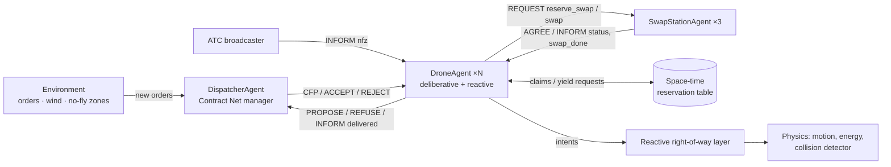
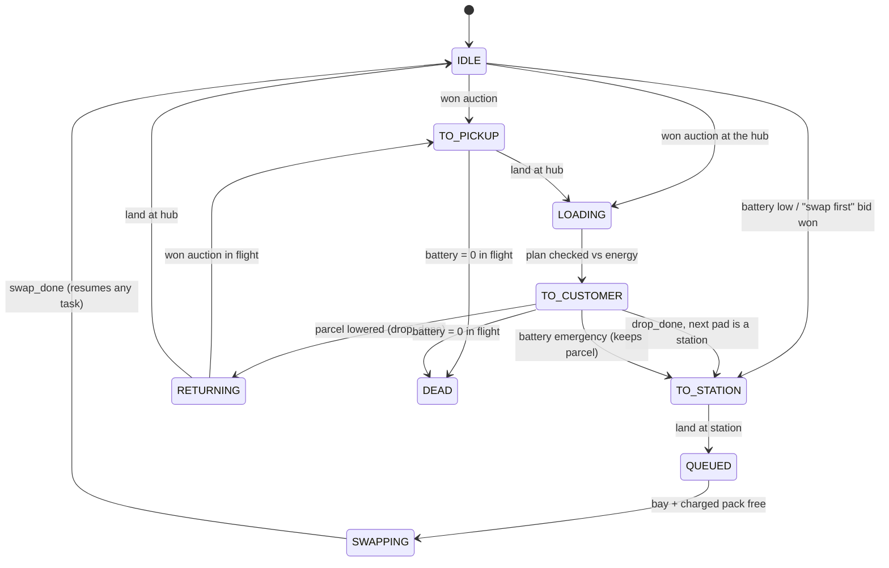
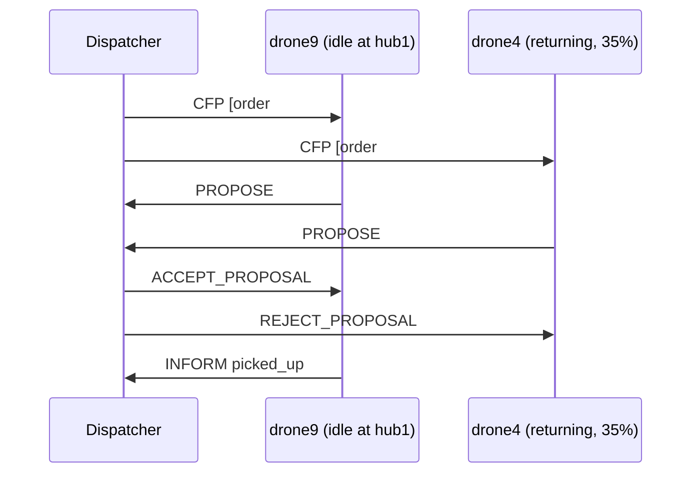

# Multi-Agent Drone Fleet Coordination for Package Delivery — Case Study

**Course:** Foundations of AI · **Artefact:** `dronefleet` (Python, standard library only) ·
**Reproduce:** `python3 run_experiments.py` (all numbers below come from that script, 10 seeds per configuration)

> **Update: altitude layers and a 3D viewer.** The airspace is now "2.5-D":
> flight layers stacked above the city, buildings with heights, vertical
> take-off and landing (§4.5). Sections 6.1–6.5 keep one flight layer, and with
> one layer the simulator reproduces the original study (every run except two
> in which a planner bug, now fixed, trapped a drone in a no-fly zone; §9);
> §6.6 varies the number of layers. Runs can be replayed in 2D or in 3D (§9).

---

## 1. Problem

A city runs an on-demand parcel service with a fleet of battery-powered drones.
Orders arrive at random and must be flown from one of two warehouses (hubs) to a
customer before a deadline (140 ticks ≈ 23 min standard, 70 ticks ≈ 12 min
express). Three things make this hard, and they interact:

1. **Allocation.** Which drone should take which parcel, given each drone's
   position, battery and current commitments? Most of that information exists
   only on the drone.
2. **Conflict-free motion.** Up to 32 drones share one airspace, with
   buildings, temporary no-fly zones and wind gusts. Two drones must never occupy
   the same cell, and never pass through each other head-on.
3. **Energy.** A pack lasts roughly two deliveries. Drones must swap batteries at
   a few stations with limited bays and a limited stock of charged packs, and
   they must never run dry in the air.

The goal is a system that is **safe by construction** (no collisions, no
depletion), **efficient** (fast, on-time, energy-frugal), **robust** to
execution noise, and **decentralised** wherever the information is.

## 2. Task environment

### 2.1 PEAS description of a drone agent

| | |
|---|---|
| **Performance** | on-time delivery rate, delivery time (mean, p95), zero collisions, zero in-flight depletion, energy per delivery |
| **Environment** | 32×24-cell city (≈3.2×2.4 km); 13 % buildings with heights; 1–5 flight layers (≈30 m each); 2 hubs, 3 swap stations, 40 customer sites; temporary no-fly zones; wind; 11+ other drones |
| **Actuators** | move N/S/E/W, climb, descend, hover, take off, land, winch a parcel down, send messages (bid, accept, request swap, yield …) |
| **Sensors** | own position and battery; messages from the dispatcher, stations and air-traffic control; neighbours' broadcast intents (V2V / ADS-B-like) |

### 2.2 Environment properties (Russell & Norvig)

| property | value | why |
|---|---|---|
| Observability | **partial** | a drone knows other drones only through reservations and broadcasts; station queues through (one-tick-stale) status messages; future no-fly zones only once announced |
| Agents | **multi-agent, cooperative** | shared goal, but competition for airspace, parcels and battery packs |
| Determinism | **stochastic** | Poisson order arrivals, wind gusts (a moving drone is held back with probability *p*) |
| Episodic? | **sequential** | a battery decision now constrains every later mission |
| Dynamics | **dynamic** | the world changes while agents deliberate (orders, zones, other drones) |
| State/time | **discrete** | grid cells, 10-second ticks |
| Model | **known** | the energy model and map are known to the agents |

## 3. Architecture



All inter-agent interaction is **message passing** with FIPA-ACL performatives
(`CFP, PROPOSE, REFUSE, ACCEPT_PROPOSAL, REJECT_PROPOSAL, REQUEST, AGREE,
INFORM, FAILURE, CANCEL`). No agent reads another agent's internal state. The
one shared structure is the **reservation table**, a blackboard of airspace
claims. It plays the role of a UTM (UAS Traffic Management) service in real
drone operations.

Each tick runs in a fixed order: environment → dispatcher → stations → drones
deliberate (highest right-of-way first) → same-tick yield negotiation → intents
→ wind → reactive resolution → physics → drones observe outcomes. Messages sent
to an agent that has already acted this tick are read next tick, so protocols
have realistic latency: CFP → bid → award takes two ticks.

### 3.1 The agents

**Drone agent: a hybrid (layered) architecture.**

* *Beliefs:* own position and battery pack; station status (queue, charged packs, estimated wait) from broadcasts; known no-fly zones; its committed plan.
* *Desires:* deliver parcels quickly; never breach the energy reserve; never collide.
* *Intentions:* the committed mission and its space-time plan, reserved in the table.

It is implemented as a finite-state mission controller:



**Dispatcher agent: Contract Net manager.** It holds the order book. Each round
it broadcasts a CFP for up to 12 open orders, collects bids, and awards greedily:
express orders first, then by deadline, each to the cheapest bidder not yet
awarded this round. Awarded drones can still decline (`FAILURE`), and the order
is re-queued. After a round with no awards the dispatcher backs off 3 ticks, so
unplaceable orders do not flood the network.

**Swap station agent: resource manager.** It has 1 robotic bay and 3 spare packs.
It serves landed drones first-come-first-served, and a swap needs a free bay
*and* a pack charged to ≥95 %. Depleted packs go on the charger (2 units/tick).
It broadcasts its status every tick and accepts reservations with an ETA, which
feed its wait estimate.

## 4. Algorithms

### 4.1 Route planning: space-time A* with a reservation table

The search state is `(cell, t, airborne)`. Actions per tick: move to one of 4
neighbours, hover, or, while on a pad, wait on the ground or take off. (With
altitude layers the cell gains a height and two more actions, climb and
descend; see §4.5. Everything in this section carries over unchanged.)
Cooperative A* (Silver, 2005) plans drones one at a time. Each drone treats
everyone else's claims as obstacles **in time**:

* **Vertex claim** `(cell, t)` — no two drones in one cell at one time.
* **Edge claim** `(a → b, t)` — blocks the opposite move `b → a` at the same tick. This is the head-on "swap" collision a vertex check alone misses.

Three design choices make it both safe and fast:

1. **Every air segment ends with a landing.** A landed drone is outside the
   airspace, so a plan never needs an infinite "stay at goal" reservation, and
   later planners cannot box it in. Ground waiting at a pad is free and always
   safe, so blocked take-offs simply wait on the pad.
2. **Exact heuristic.** h = BFS distance around buildings (cached per goal).
   Other drones and no-fly zones only lengthen paths, so h is admissible and
   consistent. When the customer lies inside a no-fly zone, the planner uses
   h = max(distance, zone_end − t). That keeps A* admissible while stopping it
   from flooding space-time with hover states: the drone waits on the ground and
   takes off just in time.
3. **Chained waypoints.** `drop` (hover for the winch time, all ticks free) →
   `land`. The whole mission leg is planned and reserved atomically.

In the default scenario a search expands about 45 nodes on average (all
expansions / all searches over the 10 runs) and a run's mean search time is
0.06–0.96 ms (median 0.07 ms).

### 4.2 Collision avoidance in depth

| layer | mechanism | handles |
|---|---|---|
| Deliberative | reservation-table planning (4.1) | all *planned* conflicts |
| Negotiation | a stuck drone *holds* its cell and sends `REQUEST yield` to anyone whose claim it overrides; those drones re-plan in the same tick. After 4 failed attempts a drone escalates priority and plans through lower-ranked drones' claims (never through a drone lowering a parcel). The rank order is strict, so this cannot livelock. | local deadlocks |
| Repair | a drone that fell one tick behind (wind) first tries to shift its remaining plan +1 tick; if the shifted claims are free it keeps them, otherwise it re-plans | execution noise, cheaply |
| Reactive | before moving, every drone broadcasts its next cell. Right-of-way: hovering drones keep their cell; airborne traffic beats a take-off; then express-carrier > carrier > empty > lower id; a head-on pair stops. The rule is re-applied until nothing changes (each pass only turns movers into holders, so it terminates, and distinct cells stay distinct). | anything the layers above missed |
| Monitor | an independent detector counts vertex and edge conflicts | measurement only |

### 4.3 Task allocation: the Contract Net Protocol



(The exchange above is illustrative. The award of express order #38 to drone9
at cost 10.1 is taken from the seed-7 event log.) Each drone bids from
**private knowledge**:

* `cost = ETA − now + 3·lateness + 5·energy/capacity`
* The ETA includes the flight to the hub, loading, the leg to the customer and the winch time.
* The energy check covers hub → customer (with payload) → nearest station, times a detour factor of 1.25, plus a 12 % reserve.

A drone that cannot afford the job **still bids**, for a *swap-first* mission
(fly to the best station, swap, then do the job) at the correspondingly later
ETA. A drone already heading to or waiting at a station bids for work that
starts *after* its swap. The auction therefore trades off "a close drone that
must swap" against "a far drone with charge" without the dispatcher knowing
any battery levels.

### 4.4 Battery management: the predictive policy

Invariant: **every committed plan satisfies**

> `battery ≥ energy(plan) + energy(landing pad → nearest station) + reserve`

The middle term matters. A drone must never land somewhere it cannot leave to
recharge. The invariant is enforced at four points:

1. when bidding (estimate)
2. when committing a delivery leg (exact energy of the A* plan; choose between landing at a hub or a station)
3. when repairing a plan
4. every airborne tick (emergency divert to the nearest station if wind has eaten the margin)

Station choice minimises `travel + believed queue wait`, using the stations'
broadcast status and ETA reservations. Idle drones below 40 % swap
proactively. The **naive baseline** only follows "accept jobs above 30 %, swap
below 30 %, divert below 10 %".

### 4.5 Altitude layers ("2.5-D")

Cells become `(x, y, z)`. `z = 0` is the ground, where drones only ever stand
on a pad; `z = 1..n_layers` are flight layers (`SimConfig.n_layers`, default 3,
one layer ≈ 30 m).

* **Buildings have heights** of 1..`n_layers` layers and block only the layers
  at or below their height, so a drone can overfly a low building. Heights are
  drawn per building block from their own random stream (low-rise more likely
  than high-rise), so the city's footprint, pads, customers and no-fly zones
  are identical for every layer count.
* **Moves per tick:** 4 horizontal moves on the current layer, climb one layer,
  descend one layer, or hover. Take-off is the vertical move ground → layer 1
  at a pad. A landing ends at layer 1 over the pad, and the touch-down happens
  at the end of that tick, exactly as a landing did before. Parcels are lowered
  from layer 1.
* **Conflicts:** vertex claims and head-on edge claims are stored per 3-D cell.
  A climb and a descent through the same two cells in the same tick are a
  vertical head-on swap. The planner never plans one, the reactive layer stops
  such a pair, and the collision detector counts it.
* **Heuristic:** the exact 3-D BFS distance over the move graph (horizontal
  moves as the layer rule allows, plus climbs and descents, all one tick). The
  graph is symmetric and every move takes one tick, so this is the exact static
  distance: admissible, and consistent (neighbouring cells differ by at most 1).
  A drone on the ground adds 1 for its take-off, as before. The A* budget
  scales with the number of layers, because the space-time volume does.
* **Energy:** climbing costs `climb_cost` (1.2) and descending `descend_cost`
  (0.5) per layer, both scaled by payload like every other action. Bid-time
  estimates multiply a flight distance in ticks by a per-tick bound,
  `max(move, (climb + descend)/2, descend)`. It never undercounts a shortest
  route, because every estimated route ends at layer 1 and so never climbs
  more than it descends. With the defaults the bound equals `move_cost`. The
  four battery checks of §4.4 are unchanged; commitment checks use the exact
  energy of the planned route, climbs included.
* **No-fly zones** close a range of layers (default: all). With
  `nfz_ceiling = k` the generated zones close layers 1..k only, and drones can
  fly over them.
* **Layer rule.** `layer_rule = "free"` lets any move happen on any layer.
  `"heading"` is a version of aviation's semicircular rule: east/west flight
  only on odd layers, north/south flight only on even layers, climbs and
  descents always. Crossing traffic is then vertically separated, but every
  turn costs a layer change. With one layer the rule has no even layer to use
  and falls back to "free".

**One layer reproduces the original model exactly.** Before the change, the
metrics of seeds 1–3 were recorded. `tests/test_regression.py` re-runs them
with `n_layers = 1` and requires every metric except timing to match. Beyond
that test, all 310 runs of the original experiment suite were re-run with one
layer and compared with the published `results/experiments.json`: 310 of 310
were identical. (A later, separate bug fix changed 2 of them; see §9.)

## 5. Experimental method

* **Scenario:**
  * City: 32×24 cells, 2 hubs, 3 stations (1 bay, 3 spare packs each).
  * Fleet: 12 drones, packs of 150 units.
  * Demand: 0.16 orders/tick for 500 ticks (≈85 orders), 20 % express.
  * Environment: 3 % gust probability, 2 announced no-fly zones per run.
* **Controlled comparison:** every configuration runs on the **same 10 seeds**
  (same city, same order stream, same gusts). Only the strategy differs.
  Tables give mean ± standard deviation. Raw per-run metrics are in
  `results/experiments.json`.
* **Dense scenario:** 24 drones, 0.35 orders/tick.
* **Airspace:** §6.1–6.5 use one flight layer, the original flat model. §6.6
  varies the number of layers (1, 3, 5) and the layer rule at 24 drones
  (0.35 orders/tick) and 32 drones (0.47 orders/tick, the same demand per
  drone), with 6 spare packs per station. §6.4 shows that the swap queue
  otherwise dominates delivery times at these fleet sizes and would hide what
  happens in the air.
* **Runtime:** the whole suite (430 simulations) runs in ≈3 minutes on a laptop.

## 6. Results

### 6.1 Collision avoidance


| configuration | collisions | delivered | avg time | p95 time | on time | drones lost | reactive holds |
|---|---:|---:|---:|---:|---:|---:|---:|
| cooperative (12 drones) | **0** | 100.0% | 34.8 ±6.8 | 70.5 ±13.4 | 99.0% | **0** | 4 |
| reactive only (12 drones) | 0 | 99.7% | 38.9 ±10.1 | 83.7 ±26.0 | 97.4% | 0.4 | 206 |
| none (12 drones) | 63.2 ±26.7 | 100.0% | 32.6 ±5.0 | 66.5 ±9.7 | 99.1% | 0 | – |
| cooperative (24 drones) | **0** | 100.0% | 57.9 ±24.6 | 142 ±71 | 86.8% | **0** | 19 |
| reactive only (24 drones) | 0 | 97.1% | 90.8 ±39.7 | 232 ±112 | 72.9% | 2.5 | 980 |
| none (24 drones) | 268 ±86 | 100.0% | 49.9 ±20.8 | 123 ±68 | 90.9% | 0 | – |

* **Without coordination, conflicts grow super-linearly with density.** They
  rise from 63 to 268 per run (4.2×) when the fleet doubles. In "none" mode
  conflicts are counted but drones fly on, so its delivery time is an
  optimistic lower bound: in reality each conflict is a potential crash.
* **The reactive layer alone is safe but inefficient.** With no look-ahead,
  drones meet head-on and gridlock at bottlenecks, such as the corridor to a
  station. At 24 drones delivery time is 57 % worse than cooperative. Some
  drones even run dry while stuck in gridlock (2.5 per run), because the jam
  blocks the emergency diversion too.
* **Cooperative reservations do both.** They give 0 collisions at a cost of only
  ≈7 % in delivery time versus the unsafe lower bound (34.8 vs 32.6 ticks), and
  the reactive layer only has to intervene ≈4 times per run, for gust fallout.

### 6.2 Task allocation


| configuration | avg time | p95 time | express avg | on time | energy/delivery | msgs (excl. telemetry) |
|---|---:|---:|---:|---:|---:|---:|
| contract net (12) | 34.8 ±6.8 | **70.5** ±13.4 | 32.1 | 99.0% | **51.1** | 1517 |
| nearest idle (12) | 34.5 ±7.5 | 75.7 ±18.3 | 30.5 | 98.9% | 52.1 | 575 (+6.7k telemetry) |
| round robin (12) | 51.3 ±7.8 | 91.5 ±13.0 | 45.8 | 97.1% | 62.8 | 634 |
| contract net (24) | **57.9** ±24.6 | 142 ±71 | 46.1 | 86.8% | **55.4** | 4224 |
| nearest idle (24) | 61.6 ±20.6 | 140 ±48 | 40.5 | 89.4% | 57.2 | 1272 |
| round robin (24) | 102 ±28 | 203 ±52 | 51.1 | 69.4% | 64.0 | 1347 |

* **Distance-aware allocation beats round robin by ~32–43 %** in delivery time.
  Round robin also burns 15–23 % more energy per parcel and needs more swaps.
* **The market matches the centralised heuristic without centralising
  information.** Contract Net is within noise of "nearest idle drone" on
  delivery time. It is slightly better on average (and uses 2–3 % less
  energy), and slightly worse on express orders. The
  difference is architectural. The nearest-idle dispatcher needs a continuous
  stream of telemetry from every drone (~6,700 messages per run) and knows
  nothing about batteries. The Contract Net dispatcher needs no drone state at
  all; each drone prices its own battery, swap plans and position into its bid.
* **Cost of the market:** bids and rejections, about 2.6× the non-telemetry
  traffic of the centralised dispatcher. Honest limitation: awards are final.
  If a better drone frees up one tick later, the order is not re-auctioned (§8).

### 6.3 Battery management


| configuration | drones lost | orders lost | delivered | emergencies | swaps | swap wait | avg time |
|---|---:|---:|---:|---:|---:|---:|---:|
| predictive (12) | **0** | **0** | **100%** | 0.2 | 44.4 | 2.7 | 34.8 |
| naive 30 % (12) | 4.8 ±3.1 | 2.2 ±1.6 | 97.4% | 6.3 | 27.8 | 2.7 | 47.2 |
| predictive (24) | **0** | **0** | **100%** | 0.1 | 101 | 28.9 | 57.9 |
| naive 30 % (24) | 8.6 ±3.5 | 4.7 ±3.1 | 97.4% | 11.5 | 60.7 | 20.2 | 44.9 |

* **A fixed threshold is not a safety rule.** A drone at 31 % happily accepts a
  long, heavy mission. On average the naive fleet **loses 40 % of its drones**
  in a run (4.8 of 12), each carrying or reserving a parcel.
* **The predictive invariant held in every run:** zero in-flight depletion.
  The 3 emergency diversions in 20 runs are the fourth enforcement point
  (§4.4) working as designed. In each case a no-fly zone was announced
  *mid-flight* over the customer. The re-plan would have hovered until the
  zone lifted, which would breach the reserve. So the drone diverted to a
  station with the parcel still on board, swapped, and finished the delivery
  from the ground once the zone lifted.
* It swaps more often (44 vs 28), because it refuses to start a mission it
  cannot finish. That is the price of safety, and at 24 drones it exposes the
  next bottleneck (§6.4). Naive's lower 24-drone delivery time is survivor
  bias: its failed orders never enter the average.

### 6.4 Scalability and infrastructure


| drones | orders | deliveries/100 ticks | avg time | on time | swap wait | ms per A* |
|---:|---:|---:|---:|---:|---:|---:|
| 4 | 24.5 | 4.45 | 35.3 | 99.6% | 0.0 | 0.32 |
| 8 | 55.4 | 9.68 | 34.9 | 98.8% | 0.5 | 0.07 |
| 12 | 84.7 | 15.0 | 34.3 | 99.3% | 2.4 | 0.21 |
| 16 | 110 | 19.0 | 31.8 | 99.2% | 6.0 | 0.22 |
| 24 | 167 | 25.3 | 47.6 | 92.1% | 24.6 | 0.11 |
| 32 | 217 | 28.1 | 73.0 | 80.6% | 59.5 | 0.11 |

Up to 16 drones, throughput scales linearly and service quality is flat. Beyond
that, delivery time rises. Planning is **not** the bottleneck: per-search cost
stays under 0.35 ms, and zero collisions hold at every size. The swap-station
queue is, rising from 2 to 60 ticks of wait. A follow-up experiment varies the
infrastructure at 24 drones:


| 24 drones | swap wait | max queue | avg time | p95 time | on time |
|---|---:|---:|---:|---:|---:|
| 1 bay, 3 spare packs | 28.9 | 7.0 | 57.9 | 142 | 86.8% |
| 1 bay, 6 spare packs | **0.85** | 2.3 | **29.6** | **55** | **99.9%** |
| 2 bays, 3 spare packs | 28.8 | 7.3 | 55.9 | 135 | 88.6% |
| 2 bays, 6 spare packs | 1.4 | 3.6 | 30.1 | 56 | 99.8% |

**Spare packs, not swap bays, are the binding constraint.** A swap takes 3
ticks, but recharging a pack takes ~40. Doubling packs halves delivery time and
restores 99.9 % on-time service; a second robot arm does almost nothing. The
simulation turns an agent-level policy question into a concrete infrastructure
recommendation.

### 6.5 Robustness to execution noise


| gust p | collisions | deviations | repairs | plans | yields | avg time | on time | energy/delivery |
|---:|---:|---:|---:|---:|---:|---:|---:|---:|
| 0.00 | 0 | 0 | 0 | 66 | 0 | 32.0 | 99.1% | 49.6 |
| 0.05 | 0 | 186 | 164 | 89 | 5.6 | 34.8 | 99.0% | 51.9 |
| 0.10 | 0 | 388 | 342 | 121 | 10.3 | 39.3 | 97.9% | 54.6 |
| 0.20 | 0 | 914 | 803 | 196 | 21.1 | 49.4 | 94.8% | 61.0 |
| 0.30 | 0 | 1621 | 1434 | 287 | 45.2 | 67.7 | 85.4% | 69.0 |

Even when 30 % of all moves are disturbed (≈1,600 deviations per run), the
fleet has **zero collisions and zero depletions**. The cheap +1-tick repair
absorbs ≈88 % of deviations without a new search. Service degrades gracefully:
time and energy rise because drones hover and wait, not because anything
fails.

### 6.6 Altitude layers

Does stacking the airspace add capacity, and does forcing a heading rule help?
The grid is 1, 3 or 5 flight layers × the `free` or `heading` rule, at 24 and
32 drones, with 6 spare packs per station so that battery swaps are not the
bottleneck (§5). With one layer the heading rule has nothing to separate, so its
rows are identical to "free" by construction; they are kept as a check.


| configuration | collisions | avg time | p95 time | reactive holds | yields | energy/delivery | ms per A* | time above layer 1 | NFZ violations |
|---|---:|---:|---:|---:|---:|---:|---:|---:|---:|
| 1 layer (24 drones) | **0** | 29.6 ±3.1 | 55.4 | 18.5 | 17.3 | 49.8 | 0.19 | 0 % | 0.2 |
| 3 layers, free (24) | **0** | 29.8 ±3.3 | 56.0 | 18.4 | 17.3 | 49.9 | 0.64 | 2.1 % | 0.3 |
| 5 layers, free (24) | **0** | 29.9 ±3.3 | 57.0 | 17.4 | 16.0 | 49.9 | 1.03 | 1.3 % | 0.5 |
| 3 layers, heading (24) | **0** | 35.5 ±7.3 | 66.4 | 15.5 | 13.2 | 56.6 | 0.77 | 57.8 % | 0 |
| 5 layers, heading (24) | **0** | 36.7 ±8.2 | 69.1 | 17.6 | 16.3 | 57.1 | 1.31 | 57.5 % | 0 |
| 1 layer (32 drones) | **0** | 31.5 ±5.4 | 59.8 | 36.4 | 39.8 | 51.4 | 0.25 | 0 % | 0.3 |
| 3 layers, free (32) | **0** | 30.5 ±5.3 | 58.2 | 31.5 | 33.5 | 50.9 | 0.78 | 2.5 % | 0.4 |
| 5 layers, free (32) | **0** | 31.2 ±5.2 | 60.3 | 31.8 | 32.6 | 51.2 | 1.24 | 1.8 % | 0.6 |
| 3 layers, heading (32) | **0** | 41.1 ±10.2 | 79.9 | 26.9 | 25.6 | 58.8 | 0.98 | 58.5 % | 0 |
| 5 layers, heading (32) | **0** | 42.1 ±10.4 | 80.1 | 31.7 | 32.1 | 59.4 | 1.64 | 58.7 % | 0 |

All 120 runs were collision-free, no drone ran out of battery, and every order
was delivered.

* **With a free choice, drones stay low.** They spend only 1.3–2.5 % of their
  flight time above layer 1. The planner minimises arrival time, and a climb
  plus a descent costs two ticks, so drones use upper layers as passing lanes
  when layer 1 is booked, not as cruising altitudes.
* **Extra layers help a little, and only when it is crowded.** At 24 drones
  nothing changes beyond noise (29.6 → 29.8 → 29.9 ticks on average). At 32
  drones, 3 layers cut reactive holds by 13 % (36.4 → 31.5) and yields by 16 %
  (39.8 → 33.5), and average delivery time falls by 1 tick (31.5 → 30.5), well
  inside the seed-to-seed spread (±5.3). A 5th layer adds nothing. With
  cooperative reservations, one layer of a 32×24 city is not yet the
  bottleneck for 32 drones.
* **The heading rule separates traffic but costs time and energy.** At 3
  layers it gives the fewest holds and yields in the table (24 drones: 15.5
  and 13.2; 32 drones: 26.9 and 25.6), because crossing traffic is on
  different layers. But every turn is now a layer change: drones climb about
  3.2–3.4 times per delivery and spend 58 % of their flight time above layer 1.
  At 3 layers, average delivery time rises by 20 % (24 drones) and 30 % (32
  drones) over one layer, and energy per delivery by 14 %. The extra energy
  means more swaps (e.g. 104 vs 90 per run at 24 drones). With 5 layers the
  rule is no better: holds rise again and time and energy grow slightly.
* **Planning cost grows with the airspace but stays small.** Mean time per
  search rises from 0.19 ms (1 layer) to 0.64 ms (3) and 1.03 ms (5) at 24
  drones, and from 0.25 to 1.24 ms at 32 drones. That is still roughly four
  orders of magnitude below the 10-second tick.
* **No-fly-zone violations** are the few ticks a drone needs to leave a zone
  that started while traffic held it inside its footprint (at most 3 ticks in
  any run). Before the planner could plan such an escape, one drone in the
  "5 layers, free, 24 drones" runs hovered in a zone until its battery ran out.
  That planner bug is fixed in this version (§9).

## 7. Discussion: what the case study shows about AI techniques

* **Search is the workhorse.** A* with an admissible, domain-exact heuristic,
  lifted into space-time, turns "don't collide" from a runtime reflex into a
  planning constraint. The key modelling move is choosing the state space
  (adding `t` and `airborne`) so that safety becomes a property of every plan.
* **Layering deliberation over reaction beats either alone.** Pure reaction
  deadlocks. Pure deliberation breaks under noise. Together (plan, repair,
  negotiate, react) they are safe *and* efficient: a hybrid agent architecture.
* **Markets are a natural fit for distributed knowledge.** The Contract Net lets
  each drone price its private battery state and even conditional plans ("I
  can do it after a swap"). The allocation quality comes from the bids, not from
  a planner that sees everything.
* **Utility is more than distance.** Bids combine time, lateness and energy.
  The battery invariant is a hard constraint layered on top of utility. The
  naive policy shows what happens when a safety constraint is approximated by
  a heuristic threshold.
* **Multi-agent systems have emergent bottlenecks.** No single agent is "wrong"
  at 32 drones; the shared charging resource saturates. Systematic experiments
  (same seeds, one factor at a time) are how such properties are found.
* **More state space is not automatically more capacity.** Adding altitude to
  the state (`(x, y, z, t)`) kept every guarantee (the heuristic stays exact,
  conflicts stay vertex + edge), but with cooperative reservations the extra
  layers were barely used. A structural rule like the heading rule trades
  efficiency for fewer interactions. Whether that pays off depends on how many
  conflicts there are to remove, which is again an empirical question.

## 8. Limitations and future work

| limitation | possible extension |
|---|---|
| Layers are used only as passing lanes (§6.6); the heading rule costs 20–30 % in delivery time | layer assignment by trip length or direction with a turn allowance; test at higher densities and with the reactive-only baseline, where conflicts are more frequent |
| A drone caught by a newly active no-fly zone needs a few ticks to leave it (§6.6) | announce zones with a clearance margin, or plan the exit before activation |
| Plans are sequential (Cooperative A*): fast but not optimal, and priority-order dependent | Conflict-Based Search or windowed WHCA* with rolling horizons for larger fleets |
| The reservation table is a shared service (a UTM provider) | fully peer-to-peer claims with gossip and conflict resolution under message loss |
| Perfect, lossless communication | message loss and latency; heartbeat time-outs; re-auction on silence |
| Awards are final; single-parcel missions | task re-allocation / decommitment; multi-drop routing (VRP with energy constraints) |
| Swap stations are passive FIFO servers | stations that schedule charging and reserve packs; demand-aware pre-positioning of idle drones (learning from order history) |
| Wind is i.i.d. per move | spatially correlated wind fields with energy effects |

## 9. How to reproduce

```bash
python3 -m unittest discover -s tests -t .      # 78 tests: planner, reservations, traffic, agents, layers, replay, system, regression
python3 run_experiments.py --seeds 10           # tables -> results/experiments.md, charts -> results/figures/
python3 run_simulation.py                       # one run -> results/replay.html (interactive 2D)
python3 run_simulation.py --view 3d             # the same run in 3D -> results/replay_3d.html
```

**Replay viewers.** Both viewers share one core, so the timeline, playback
controls, fleet list, follow card and plain-language event log are identical.

* The **2D viewer** is a top-down map in a single self-contained file that
  works offline. In stacked airspace each drone's label shows its layer ("L2"),
  buildings are shaded by height, and drones stacked over the same spot are
  drawn side by side.
* The **3D viewer** (`--view 3d`) draws the same run with three.js (a pinned
  r147 build and its OrbitControls, loaded from cdn.jsdelivr.net, so it needs
  an internet connection):
  * buildings at their real height (vertical scale exaggerated about 2×), with
    labelled hub and station pads and customer order rings;
  * quadcopters coloured by the same state palette, with a battery ring, a
    parcel and a line down to the ground;
  * booked routes as 3-D lines, no-fly zones as translucent red volumes over
    the layers they close, and collision flashes.

  You can orbit, zoom and pan. Clicking a drone follows it with a chase camera
  and opens the follow card. Instanced meshes keep 32 drones at a handful of
  draw calls, the camera fits the city to the screen at phone width, and both
  viewers have light and dark themes.

**Fix found by the layer experiment.** A drone held by traffic inside a
zone's footprint when the zone started could not plan at all. Every zone cell,
its own included, was forbidden, so it hovered until the zone lifted. The
planner now lets such a drone fly out by the quickest route: the zone's cells
cost 1000 per tick instead of being forbidden. A drone outside every active
zone plans exactly as before. Of the 310 runs behind §6.1–6.5, only the two
with a trapped drone changed (55 and 56 violation-ticks became 2 each). The
affected rows moved slightly: in §6.1 (reactive only, 24 drones) average
delivery time went from 90.6 to 90.8 ticks, and in §6.4 (1 bay, 6 spare packs)
from 29.5 to 29.6. The tables above show the current values.

The system-level tests encode the headline guarantees on three seeds: no
collisions, no depletion, every order delivered, no no-fly-zone violations,
battery packs conserved, determinism. They also check that the baselines fail
as expected: uncoordinated flight collides, and the reactive layer alone does not.
`tests/test_layers.py` checks the same guarantees with 3 and 5 layers (free and
heading), plus the 3-D planning rules: vertical moves, overflying low but not
tall buildings, no vertical head-on swaps, climb energy, and estimates that
never undercount a route. `tests/test_regression.py` checks that one layer
reproduces the metrics recorded before layers were added.

## References

* R. G. Smith (1980). *The Contract Net Protocol: High-Level Communication and Control in a Distributed Problem Solver.* IEEE Trans. Computers.
* D. Silver (2005). *Cooperative Pathfinding.* AIIDE.
* P. E. Hart, N. J. Nilsson, B. Raphael (1968). *A Formal Basis for the Heuristic Determination of Minimum Cost Paths.*
* G. Sharon, R. Stern, A. Felner, N. Sturtevant (2015). *Conflict-Based Search for Optimal Multi-Agent Pathfinding.* AIJ.
* S. Russell, P. Norvig. *Artificial Intelligence: A Modern Approach* (agents, PEAS, environment types, search).
* M. Wooldridge. *An Introduction to MultiAgent Systems* (BDI, hybrid architectures, auctions).
* FIPA (2002). *ACL Message Structure Specification.*
